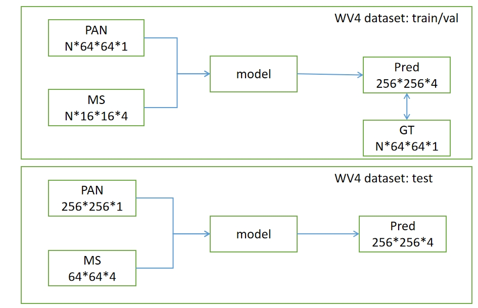
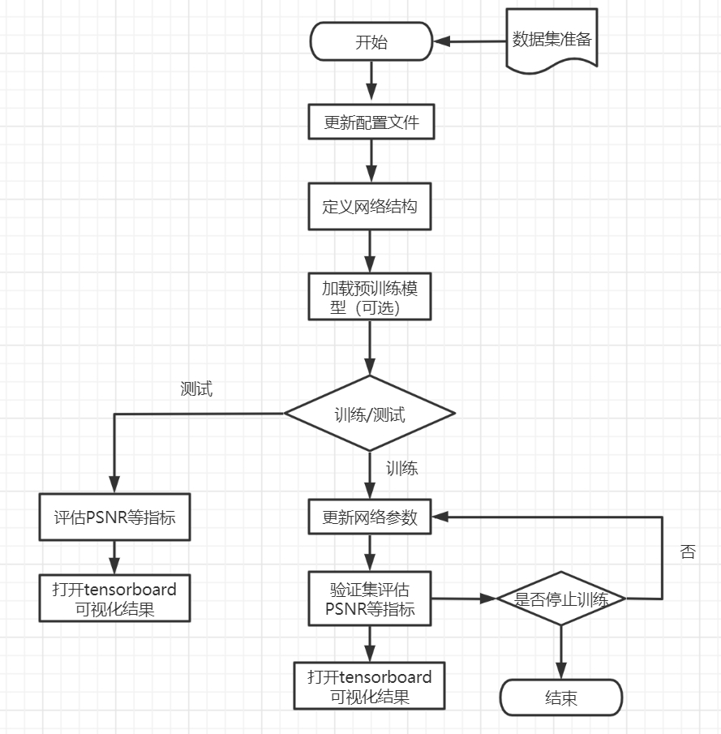
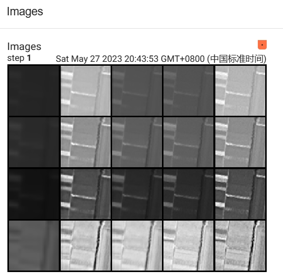

# Multi-spectral Pansharpening
Pansharpening is a process of merging a highresolution panchromatic (PAN) image and a low-resolution multispectral (LRMS) image to create a single high-resolution multispectral (HRMS) image.
# What we have done?
our code is based on HyperTransformer(CVPR 2022), which is used for Hyperspectral pansharpening
- **Paper**: [`CVPR-2022-Open-Access`](https://openaccess.thecvf.com/content/CVPR2022/html/Bandara_HyperTransformer_A_Textural_and_Spectral_Feature_Fusion_Transformer_for_Pansharpening_CVPR_2022_paper.html) or [`arxiv`](https://arxiv.org/abs/2203.02503).
1. 原论文是做高光谱图像融合的，我们拓展到多光谱全色锐化领域，两个任务不同，数据的尺度、通道维度等不一样，我们修改了指标评估代码和训练推理的流程上一些适配性的问题，并提供了新的训练好的模型和结果（WV4数据）；
2. 原论文的backbone收敛很慢，我们替换为预训练的RESnet50，并为了将RGB上训练的res50模型应用到遥感图像，在网络前后增加了一些层来修改通道，只使用其前半部分结构等，具体在models/HyperTransformer的979行后面 
3. 同样为了加速收敛，我们将作者的所有cross attention层换成了MMCV里deformable detr的attention，加入了reference point，具体在1045行后面，原论文使用10000个epoch训练，实际也需要2000多，但现在只需要约200个epoch达成收敛，效果还行  
4. 仓库增加了新的代码注解和google colab, hugging face等辅助

1) extend the hyperspectral datasets(over 100 bands) to multispctral datasets(only have 4 bands)
2) add Resnet50 pretrained model as backbone for spectral features extraction
3) remove origin cross-attention block as attention block in Deformable Detr
4) We will release datasets, checkpoints,comparision result and so on, beside, we want to make a google colab for easy implement and understand, please wait for our update!!!


# Data Flow chart




# Setting up a virtual conda environment
Setup a virtual conda environment using the provided ``requirements.txt``.
```
conda create --name HyperTransformer --file requirements.txt
conda activate HyperTransformer
```

# Download datasets
We use multi-spectral pansharpening dataset acquired by WorldView4(WV4),QuickBird(QB),WorldView2(WV2) satalite
The number of bands in WV4 and QB is 4, and WV2 is 8
1) **WV4 WV2 QB** [`Download the .h5 file here`](https://pan.baidu.com/s/1ZdIHrQB93-ASi2zR5kJz0w?pwd=dffs)
You need ot updata the path and spctral bands in configs/config_HSIT_PRE.json for crossponding datasets.
Beside, you need to edit 144 line in dataloader/HSI_dataset.py for your data path.
# Trained models and pansharpened results on test-set
You can download trained models and final prediction outputs through the follwing links for each dataset.
 1) WV4: [`Download here`](https://pan.baidu.com/s/1rtO6g39PWOeK7kD0cqkrIw?pwd=qf3q)


# Testing by pretrained models
just set testing epoch=1, run
`python test.py --config configs/config_HSIT_PRE.json --resume best_model_path.pth`.
and then you can get testing result!

# visualization
using tensorboard under your CMD console, `tensorboard --logdir your_dir_path_of_events.out.tfevents...`
like this: you can get metrics and images(from left to right, you will get MS,MS-pred,pred,reference,MS-reference)

# Training the Backbone of HyperTrasnformer
Use the following codes to train HyperTransformer on the four datasets.
 1) training on WV4|QB|WV2 Dataset:
    
    Change "train_dataset" to "LRHR_dataset" in config_HSIT_PRE.json.
    Update LRHRDataset class in HSI_dataset.py for path of dataset.

    2) Then use following commad to train on Pavia Center dataset. 
    `python train.py --config configs/config_HSIT_PRE.json`.

# Experiment Result
 The results on WV4 dataset showed that this method is a qualified Pansharpening solution.

|  MetricsMethod | Ours | Original | Pannet    |
| :-----| ----: | :----: |-----|
|  CC  | 0.95| 0.88  | 0.94  |
|  SAM  | 1.88  | 2.30 |1.62  |
|  RMSE  | 0.02  | 0.06 |0.03  |
|  ERGAS  | 0.38  | 0.48 |0.34  |
|  PSNR  | 32.30  | 28.31 |31.40  |